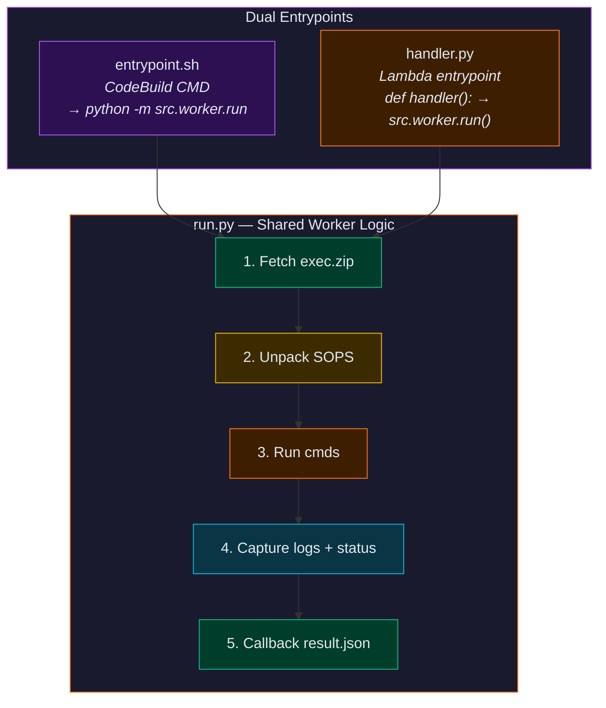

# Repo Structure

```
aws-exe-sys/
├── CLAUDE.md
│
├── .github/
│   └── workflows/
│       └── deploy.yml                 # single workflow, all 6 steps
│
├── src/
│   ├── common/                        # shared libraries
│   │   ├── __init__.py
│   │   ├── models.py                  # job/order dataclasses
│   │   ├── trace.py                   # trace_id + leg generation
│   │   ├── flow.py                    # flow_id generation
│   │   ├── dynamodb.py                # orders, order_events, locks CRUD
│   │   ├── s3.py                      # upload, presign, read result.json
│   │   ├── sops.py                    # encrypt, decrypt, repackage
│   │   ├── code_source.py             # git clone, S3 fetch, credential retrieval, zip (shared)
│   │   └── vcs/
│   │       ├── __init__.py
│   │       ├── base.py                # ABC interface for VCS providers
│   │       └── github.py              # GitHub: PR comments
│   │
│   ├── init_job/                      # Part 1: init_job
│   │   ├── __init__.py
│   │   ├── handler.py                 # Lambda entrypoint
│   │   ├── validate.py                # Step 1: validate all orders
│   │   ├── repackage.py               # Step 2: SOPS + creds + presigned URL
│   │   ├── upload.py                  # Step 3: upload exec.zip to S3
│   │   ├── insert.py                  # Step 4: insert orders to DynamoDB
│   │   └── pr_comment.py              # Step 5: init PR comment
│   │
│   ├── orchestrator/                  # Part 2: execute_orders
│   │   ├── __init__.py
│   │   ├── handler.py                 # Lambda entrypoint (S3 event)
│   │   ├── lock.py                    # acquire/release run_id lock
│   │   ├── read_state.py              # Step 1: read orders + S3 results
│   │   ├── evaluate.py                # Step 2: dependency resolution
│   │   ├── dispatch.py                # Step 3: invoke Lambda/CodeBuild/SSM + watchdog
│   │   └── finalize.py                # Step 5: done endpoint + PR summary
│   │
│   ├── watchdog_check/                # timeout safety net
│   │   ├── __init__.py
│   │   └── handler.py                 # check result.json or write timed_out
│   │
│   ├── worker/                        # dual-purpose: Lambda + CodeBuild
│   │   ├── __init__.py
│   │   ├── handler.py                 # Lambda entrypoint
│   │   ├── entrypoint.sh              # CodeBuild CMD (calls run.py)
│   │   ├── run.py                     # shared: unpack, execute, callback
│   │   └── callback.py                # PUT result.json to presigned URL
│   │
│   └── ssm_config/                    # SSM config provider (Part 1b)
│       ├── __init__.py
│       ├── handler.py                 # Lambda entrypoint (POST /ssm)
│       ├── models.py                  # SsmJob/SsmOrder dataclasses
│       ├── validate.py                # Validate SSM orders (targets, cmds, timeout)
│       ├── repackage.py               # Package code + creds, no SOPS
│       └── insert.py                  # Insert SSM orders to DynamoDB
│
├── docker/
│   └── Dockerfile                     # single image, all functions
│
├── infra/
│   ├── 00-bootstrap/                  # Step 1: state bucket
│   │   ├── main.tf                    # S3 bucket + versioning + encryption
│   │   ├── variables.tf
│   │   └── outputs.tf
│   │
│   ├── 01-ecr/                        # Step 2: ECR repo
│   │   ├── main.tf
│   │   ├── variables.tf
│   │   └── outputs.tf
│   │
│   └── 02-deploy/                     # Step 4: everything else
│       ├── main.tf
│       ├── variables.tf
│       ├── outputs.tf
│       ├── api_gateway.tf             # HTTP API + POST /init + POST /ssm
│       ├── lambdas.tf                 # 5 Lambda functions (all ECR image)
│       ├── step_functions.tf          # watchdog state machine
│       ├── dynamodb.tf                # orders, order_events (+GSI), locks
│       ├── s3.tf                      # internal + done buckets + lifecycles
│       ├── codebuild.tf               # project definition (ECR image)
│       ├── ssm_document.tf            # SSM Document (aws-exe-sys-run-commands)
│       ├── iam.tf                     # all IAM roles
│       └── s3_notifications.tf        # S3 event → orchestrator Lambda
│
├── scripts/
│   ├── generate_backend.sh            # generates backend.tf for a TF stage
│   └── generate_tfvars.sh             # generates terraform.tfvars
│
├── tests/
│   ├── smoke/
│   │   └── test_deploy.sh             # post-deploy verification
│   ├── unit/
│   │   ├── test_models.py
│   │   ├── test_trace.py
│   │   ├── test_flow.py
│   │   ├── test_dynamodb.py
│   │   ├── test_s3.py
│   │   ├── test_sops.py
│   │   ├── test_vcs_github.py
│   │   ├── test_validate.py
│   │   ├── test_repackage.py
│   │   ├── test_upload.py
│   │   ├── test_insert.py
│   │   ├── test_orchestrator_lock.py
│   │   ├── test_evaluate.py
│   │   ├── test_dispatch.py
│   │   ├── test_finalize.py
│   │   ├── test_watchdog.py
│   │   ├── test_worker_run.py
│   │   └── test_worker_callback.py
│   └── integration/
│       ├── test_init_job.py
│       └── test_orchestrator.py
│
└── requirements.txt
```

---

## Docker Image Strategy

Single image based on `public.ecr.aws/lambda/python:3.14` (Amazon Linux 2023).

All Lambda functions use the same ECR image with different `image_config.command` overrides:

| Function | Command Override | Timeout | Memory |
|---|---|---|---|
| init_job | `src.init_job.handler.handler` | 300s | 512MB |
| orchestrator | `src.orchestrator.handler.handler` | 600s | 512MB |
| watchdog_check | `src.watchdog_check.handler.handler` | 60s | 256MB |
| worker | `src.worker.handler.handler` | 600s | 1024MB |
| ssm_config | `src.ssm_config.handler.handler` | 300s | 512MB |

CodeBuild uses the same image with the default `CMD` which runs `entrypoint.sh`.



---

## File Responsibilities

### src/common/

| File | Purpose |
|---|---|
| `models.py` | Dataclasses for Job, Order, OrderEvent, LockRecord |
| `trace.py` | Generate trace_id, create new legs with epoch |
| `flow.py` | Generate flow_id from username + trace_id + label |
| `dynamodb.py` | CRUD for orders, order_events, locks tables |
| `s3.py` | Upload exec.zip, generate presigned URLs, read result.json, write done endpoint |
| `sops.py` | Encrypt env_vars + creds into SOPS bundle, decrypt, auto-gen temp keys |
| `code_source.py` | Shared code source operations: git clone, S3 fetch, credential retrieval (SSM/Secrets Manager), zip (extracted from init_job/repackage.py) |
| `vcs/base.py` | ABC: create_comment, update_comment, find_comment_by_tag |
| `vcs/github.py` | GitHub implementation: PR comments, CRUD, pagination |

### src/init_job/

| File | Purpose |
|---|---|
| `handler.py` | Lambda entrypoint, calls process_job_and_insert_orders |
| `validate.py` | Validate all orders have cmds, timeout, code source |
| `repackage.py` | Fetch code + creds, encrypt with SOPS, generate presigned callback URL, re-zip |
| `upload.py` | Upload exec.zip to S3, optional stripped copy |
| `insert.py` | Insert all orders into DynamoDB orders table |
| `pr_comment.py` | Post initial PR comment with order summary |

### src/orchestrator/

| File | Purpose |
|---|---|
| `handler.py` | Lambda entrypoint, parse run_id from S3 event path |
| `lock.py` | Acquire/release DynamoDB lock for run_id |
| `read_state.py` | Query orders table + check S3 for result.json files |
| `evaluate.py` | Dependency resolution, determine ready/failed/waiting orders |
| `dispatch.py` | Invoke Lambda, start CodeBuild, or send SSM Run Command; start watchdog SF, update status |
| `finalize.py` | Write done endpoint, final PR comment, job-level order_event, release lock |

### src/watchdog_check/

| File | Purpose |
|---|---|
| `handler.py` | Check if result.json exists in S3, write timed_out if timeout exceeded |

### src/worker/

| File | Purpose |
|---|---|
| `handler.py` | Lambda entrypoint, calls run() |
| `entrypoint.sh` | CodeBuild CMD, calls run.py via python |
| `run.py` | Fetch exec.zip, unpack SOPS, execute cmds, capture stdout/stderr |
| `callback.py` | PUT result.json to presigned S3 URL |

### src/ssm_config/

| File | Purpose |
|---|---|
| `handler.py` | Lambda entrypoint for POST /ssm, calls process_ssm_job |
| `models.py` | SsmJob and SsmOrder dataclasses (separate from common models) |
| `validate.py` | Validate SSM orders: cmds, timeout, ssm_targets (instance_ids or tags) |
| `repackage.py` | Package code + fetch credentials (no SOPS), write cmds.json + env_vars.json, zip |
| `insert.py` | Insert SSM orders into DynamoDB with execution_target="ssm", ssm_targets, env_dict |
